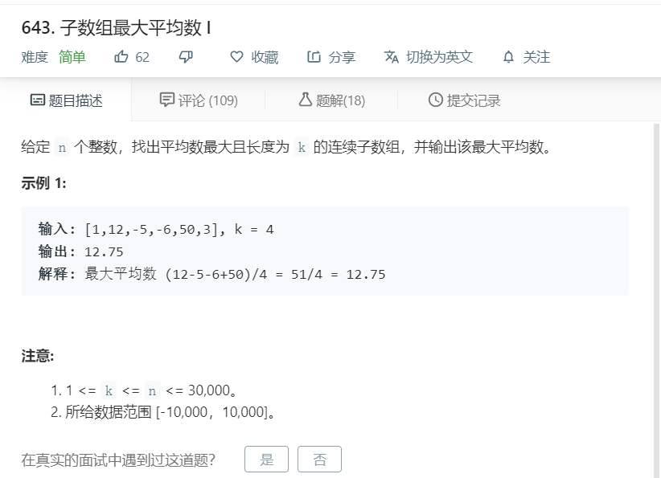

# 643.子数组最大平均数I
  

```
/**
 * @param {number[]} nums
 * @param {number} k
 * @return {number}
 */
var findMaxAverage = function(nums, k) {
  let temp = [],max=Math.min(...nums),num=0;
  for(let i=0;i<nums.length;i++){
      if(temp.length < k){
          temp.push(nums[i]);
          
      }else{
        //   console.log(temp);
          temp.forEach((el,index)=>{
              num += el;
          })
          if(num/k > max){
              max = num/k;
          }
          num = 0;
          temp.splice(0,1);
          temp.push(nums[i]);
        //   console.log(temp);
      }
  }
  temp.forEach((el,index)=>{
    num += el;
  })
  if(num/k > max){
    max = num/k;
  }
//   console.log(temp,max)
  return max;
};
```