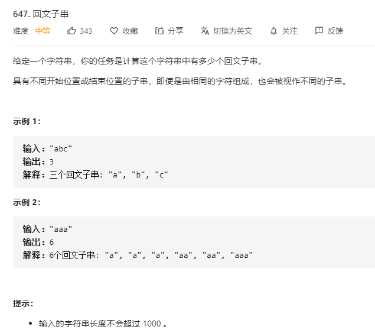

# 647.回文子串
  

```
/**
 * @param {string} s
 * @return {number}
 */
var countSubstrings = function(s) {
    let all = 0;

    const mid = (before, end, who) => {
        while(before-1 > -1 || end + 1 < s.length) {
            if (s[before-1] === s[end+1]) {
                all++;
                before -= 1;
                end += 1;
            } else {
                break;
            }
        }
    }

    for(let i=0;i<s.length;i++) {
        if (i-1 > -1 && s[i] === s[i-1]) {
            all++;

            let before = i-1, end = i;

            mid(before, end);
        }

        if(i-1 > -1 && i+1 < s.length && s[i+1] === s[i-1]) {
            all++;

            let before = i-1, end = i+1;

            mid(before, end);
        }
    }

    // console.log(all)

    return all + s.length;
};
```