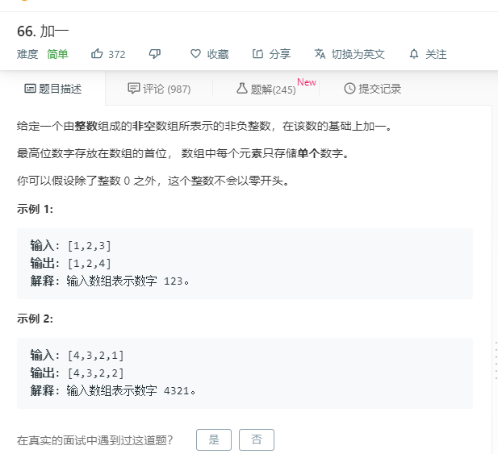

# 66.加一
  

```
/**
 * @param {number[]} digits
 * @return {number[]}
 */
var plusOne = function(digits) {
    if(digits.length == 1){
    if(digits[0] < 9){
      return [digits[0]+1];
    }else{
      return [1,digits[0]+1-10];
    }
  }
  let temp = [],num = 0;
  for(let i=digits.length-1;i>=0;i--){
    if(i == digits.length-1){
        let last = digits[i] + 1 + num;
        if(last > 9){
            num = 1;
            last -= 10;
            temp.push(last);
        }else{
            temp.push(last);
            num = 0;
        }
    }else if(i != 0){
        let last = digits[i] + num;
        if(last > 9){
            num = 1;
            last -= 10;
            temp.push(last);
        }else{
            temp.push(last);
            num = 0;
        }
    }else{
      let last = digits[i] + num;
      if(last > 9){
        num = 1;
        last -= 10;
        temp.push(last);
        temp.push(1);
      }else{
        temp.push(last);
      }
    }
  }
  // console.log(temp.reverse());
  return temp.reverse();
};
```
