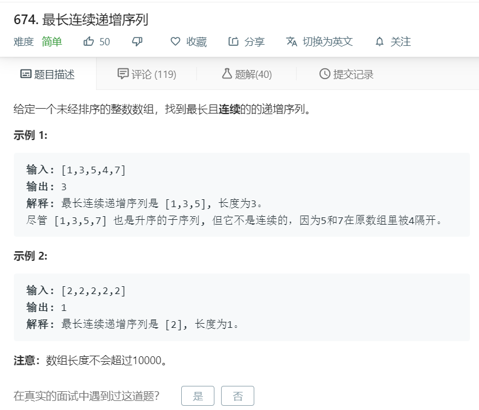

# 674.最长连续递增序列
  

```
/**
 * @param {number[]} nums
 * @return {number}
 */
var findLengthOfLCIS = function(nums) {
    if(nums.length == 0){
        return 0;
    }
  let temp = [],result = [];
  for(let i=0;i<nums.length;i++){
      if(temp.length == 0){
          temp.push(nums[i]);
          if(i == nums.length-1){
            result.push(temp.length);
          }
      }else{
          if(nums[i] > temp[temp.length-1]){
              temp.push(nums[i]);
              if(i == nums.length-1){
                result.push(temp.length);
              }
          }else{
            // console.log(temp);
            result.push(temp.length);
            if(i == nums.length-1){
              result.push(1);
              break;
            }
            temp = [];
            temp.push(nums[i]);
          }
      }
  }

//   console.log(result);
  return Math.max(...result);
};
```