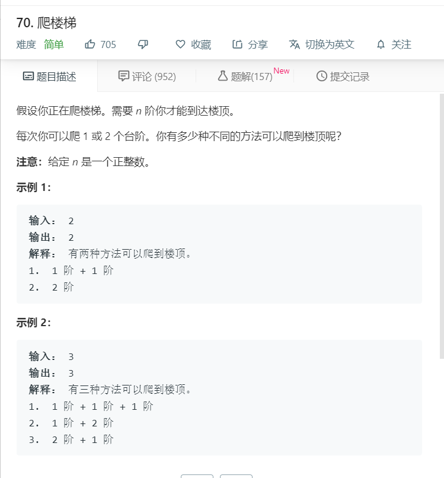

# 70爬楼梯
  

```
/**
 * @param {number} n
 * @return {number}
 */
var climbStairs = function(n) {
  let temp,one=1,two=2;
  if(n == 1 || n == 2)return n;
  else{
      for(let i=2;i<n;i++){
          [one,two] = [two,one+two];
      }
      temp = two;
  }
//   console.log(temp);
  return temp;
};
```