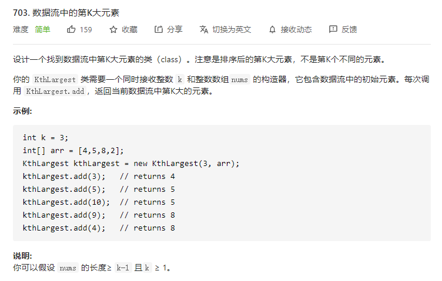

# 703.数据流中的第K大元素
    

## 最小堆思想

```
/**
 * @param {number} k
 * @param {number[]} nums
 */
var KthLargest = function(k, nums) {
    this.k = k;
    nums.sort((a,b) => a-b);
    if (nums.length < k) {
        this.queue = nums.slice();
    } else {
        this.queue = nums.slice(nums.length - k);
    }
};

/** 
 * @param {number} val
 * @return {number}
 */
KthLargest.prototype.add = function(val) {
    if (this.queue.length < this.k) {
        this.queue.push(val);
        return Math.min(...this.queue);
    } else {
        let min = Math.min(...this.queue);
        if (min >= val) {
            return min;
        } else {
            let pos = this.queue.indexOf(min);
            this.queue.splice(pos, 1);
            this.queue.push(val);
            return Math.min(...this.queue);
        }
    }
};

/**
 * Your KthLargest object will be instantiated and called as such:
 * var obj = new KthLargest(k, nums)
 * var param_1 = obj.add(val)
 */
```