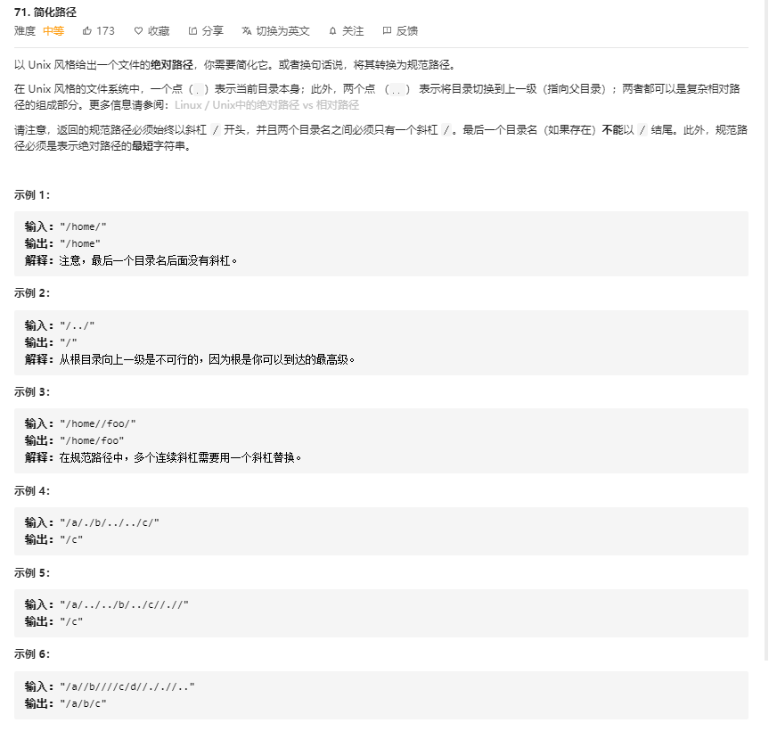
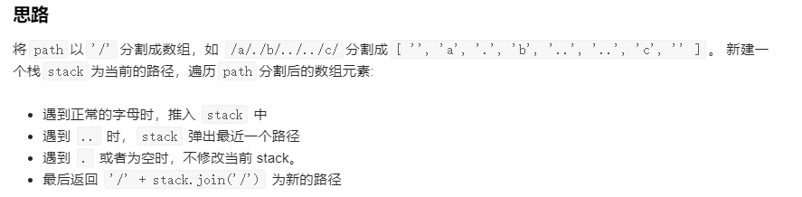

# 71.简化路径
    



```
/**
 * @param {string} path
 * @return {string}
 */
var simplifyPath = function(path) {
    const temp = path.split("/");

    console.log(temp);

    let res = [];

    for(let i in temp) {
        if(temp[i] == "." || temp[i] == "") {
            continue;
        }
        else if(temp[i] === "..") {
            res.pop();
        } 
        else {
            res.push(temp[i]);
        }
    }

    console.log(res);

    return "/" + res.join("/");
};
```