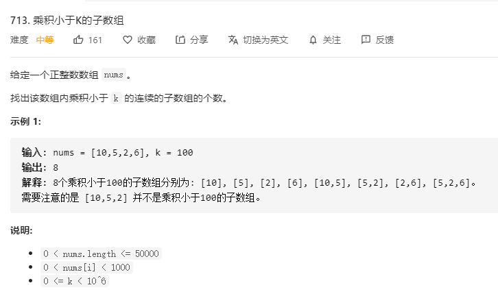

# 713.乘积小于K的子数组
  

```
/**
 * @param {number[]} nums
 * @param {number} k
 * @return {number}
 */
var numSubarrayProductLessThanK = function(nums, k) {
    if (k <= 1) {
        return 0;
    }
    let res = 0, right = 0;

    let temp = 1;

    for (let left = 0;left<nums.length;left++) {
        temp *= nums[left];

        while(temp >= k) {
            temp /= nums[right++];
        }

        res += (left-right + 1);
    }

    return res;
};
```