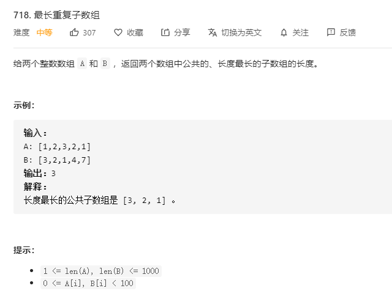

# 718.最长重复子数组
  

```
/**
 * @param {number[]} A
 * @param {number[]} B
 * @return {number}
 */
var findLength = function(A, B) {
    let alen = A.length;
    let blen = B.length;
    let max = -Infinity;
    const mid = (len, whoStart, who) => {
        let res = 0;
        let tempLen = 0;

        for (let i=0;i<len;i++) {
            if ((who === 1 && A[i] === B[whoStart+i]) ||(who === 2 && B[i] === A[whoStart+i])) {
                tempLen++;
                res = Math.max(res, tempLen);
            } else {
                tempLen = 0;
            }
        }

        return res;
    }
    for(let i=0;i<alen;i++) {
        let now = mid(i+1, blen-i-1, 1);
        max = Math.max(max,now);
    }

    for(let i=1;i<alen;i++) {
        let now = mid(alen-i,i,2);
        max = Math.max(max,now);
    }

    return max;
};
```