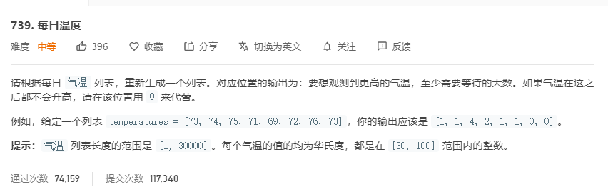

# 739.每日温度
  

```
/**
 * @param {number[]} T
 * @return {number[]}
 */
var dailyTemperatures = function(T) {
    let one = [T.length-1],result = [0];

    for(let i=T.length-2;i>=0;i--) {
        if(T[i] < T[one[0]]) {
            result.unshift(one[0] - i);
        }else {
            while(T[i] >= T[one[0]]) {
                one.shift();
            }
            if(one.length == 0) {
                result.unshift(0);
            }else {
                result.unshift(one[0] - i);
            }
        }
        one.unshift(i);
    }

    console.log(result);
    return result;
};
```