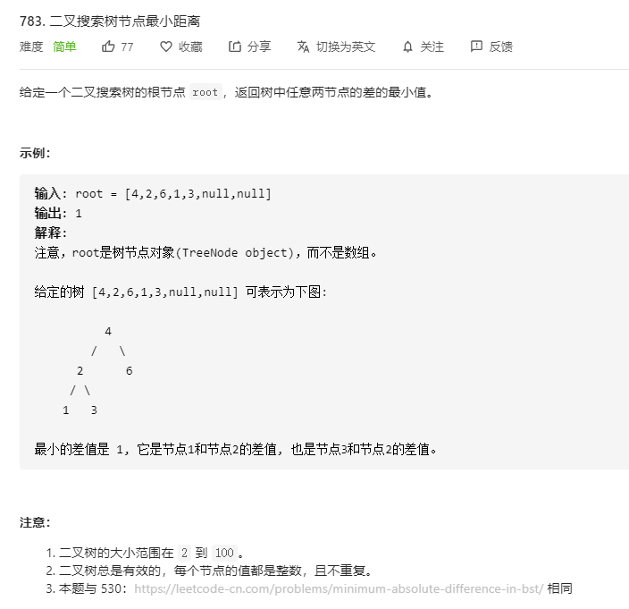

# 783.二叉搜索树节点最小距离
  

```
/**
 * Definition for a binary tree node.
 * function TreeNode(val) {
 *     this.val = val;
 *     this.left = this.right = null;
 * }
 */
/**
 * @param {TreeNode} root
 * @return {number}
 */
var minDiffInBST = function(root) {
    let res = [];

    const mid = (r) => {
        if (!r) {
            return ;
        } 

        mid(r.left);
        res.push(r.val);
        mid(r.right);
    }

    mid(root);

    // res.sort((a,b)=>a-b);

    console.log(res);

    let min = Infinity;

    res.map((el, index) => {
        if (index !== 0 || index !== res.length - 1) {
            let now = el - res[index-1];
            min = min > now ? now : min;
        }
    })

    return min;
};
```