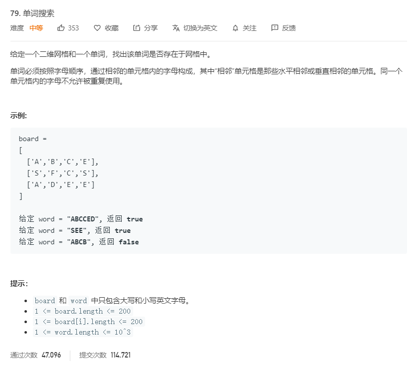

# 79.单词搜索
  

```
/**
 * @param {character[][]} board
 * @param {string} word
 * @return {boolean}
 */
var exist = function(board, word) {
    //回溯
    let one = (i,j,k) => {
        //回溯终止条件
        if(k+1 == word.length){
            return true;
        }

        //保存当前用于之后回溯
        let temp = board[i][j];
        board[i][j] = '*';

        if(i-1 >=0 && board[i-1][j] == word[k+1] && one(i-1,j,k+1)){
            return true;
        }
        if(i+1 < board.length && board[i+1][j] == word[k+1] && one(i+1,j,k+1)){
            return true;
        }
        if(j-1 >=0 && board[i][j-1] == word[k+1] && one(i,j-1,k+1)){
            return true;
        }
        if(j+1 < board[0].length && board[i][j+1] == word[k+1] && one(i,j+1,k+1)){
            return true;
        }

        board[i][j] = temp;   
    }

    for(let i=0;i<board.length;i++){
        for(let j=0;j<board[0].length;j++){
            if(board[i][j] == word[0]){
                if(one(i,j,0)){
                    return true;
                }
            }
        }
    }

    return false;
};
```