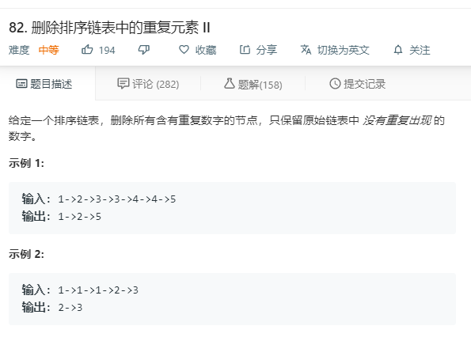

# 82.删除排序链表中的重复元素II
  

```
/**
 * Definition for singly-linked list.
 * function ListNode(val) {
 *     this.val = val;
 *     this.next = null;
 * }
 */
/**
 * @param {ListNode} head
 * @return {ListNode}
 */
var deleteDuplicates = function(head) {
    if(!head){
        return null;
    }
    let temp = [],one = null;
    while(head){
        if(temp.length == 0){
            temp.push(head);
            if(one == head.val){
                temp.pop();
            }else{
                one = head.val;
            }
            head = head.next;
        }else{
            if(head.val != one){
                temp.push(head);    
                one = head.val;
                head = head.next;
            }else{
                // console.log(temp);
                if(temp.length > 0 && one == temp[temp.length-1].val){
                    temp.pop();
                }
                // temp.pop();
                head = head.next;
            }
        }
    }
    if(temp.length == 0){
        return null;
    }
    for(let i=0;i<temp.length-1;i++){
        temp[i].next = temp[i+1];
    }
    temp[temp.length-1].next = null;
    return temp[0];
};
```