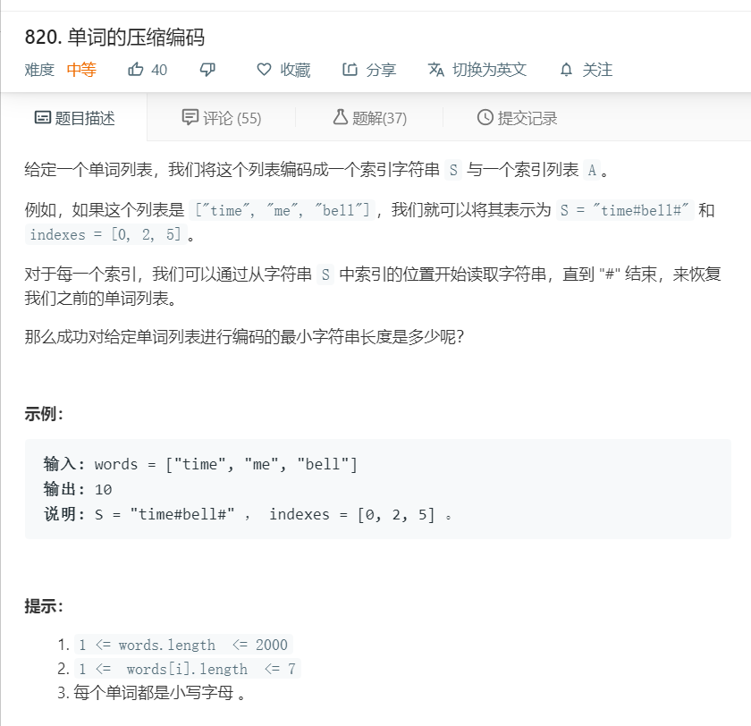

# 820.单词的压缩编码


```
/**
 * @param {string[]} words
 * @return {number}
 */
var minimumLengthEncoding = function(words) {
    words.sort((a,b)=>a.length-b.length);
    // console.log(words)
    let temp = [];
    for(let i=0;i<words.length-1;i++){
        let only = 0;
        for(let j=i+1;j<words.length;j++){
            if(words[j].endsWith(words[i])){
                only++;
                break;
            }
        }
        if(only == 0){
            temp.push(words[i]);
        }
    }
    temp.push(words[words.length-1]);
    console.log(temp)
    let num = temp.length;
    let result = num + temp.join('').length;
    return result;
};
```