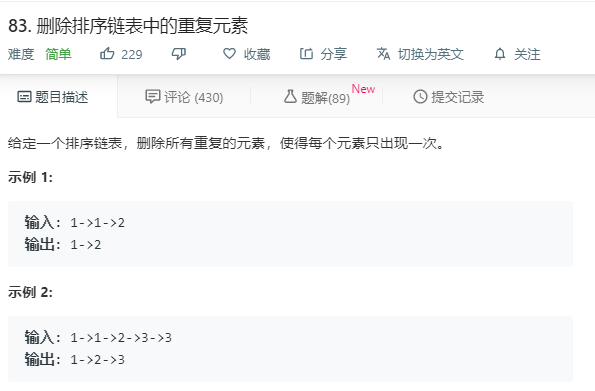

# 83.删除排序链表中的重复元素
  

```
/**
 * Definition for singly-linked list.
 * function ListNode(val) {
 *     this.val = val;
 *     this.next = null;
 * }
 */
/**
 * @param {ListNode} head
 * @return {ListNode}
 */
var deleteDuplicates = function(head) {
    let temp = [head];
    while(head){
        while(head.next && head.next.val == head.val && head.next.next){
            head.next = head.next.next;
        }
        while(head.next && head.next.val == head.val && !head.next.next){
            head.next = null;
        }
        head = head.next;
    }
    
    return temp[0];
};
```