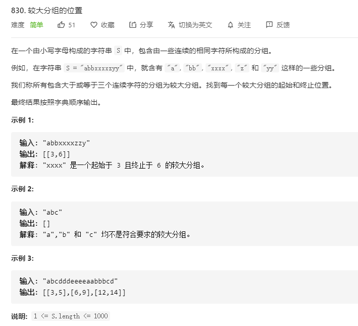

# 830.较大分组的位置
  

```
/**
 * @param {string} S
 * @return {number[][]}
 */
var largeGroupPositions = function(S) {
    let only = [], res = [];

    let s = S.split('');
    s.map((el, index) => {
        // console.log(only, el)
        if (only.length === 0 || s[only[only.length-1]] === el) {
            only.push(index);
            if (index === s.length - 1 && only.length >= 3) {
                res.push([only[0], only[only.length-1]]);
            }
        } else {
            if (only.length >= 3) {
                res.push([only[0], only[only.length-1]]);
            }
            only = [];
            only.push(index);
        }
    })

    return res;
};
```