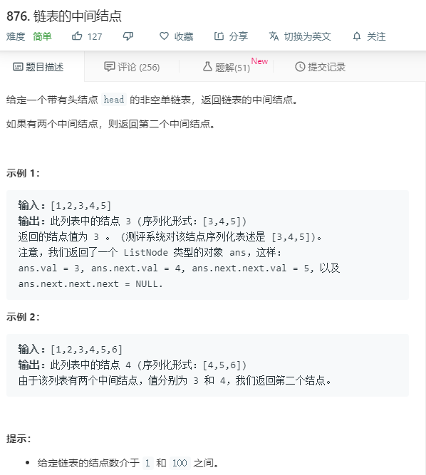

# 876.链表的中间结点
  

```
/**
 * Definition for singly-linked list.
 * function ListNode(val) {
 *     this.val = val;
 *     this.next = null;
 * }
 */
/**
 * @param {ListNode} head
 * @return {ListNode}
 */
var middleNode = function(head) {
    let temp = [];
    while(head){
        temp.push(head);
        head = head.next;
    }

    let num = temp.length >> 1;
    return temp[num];
};
```