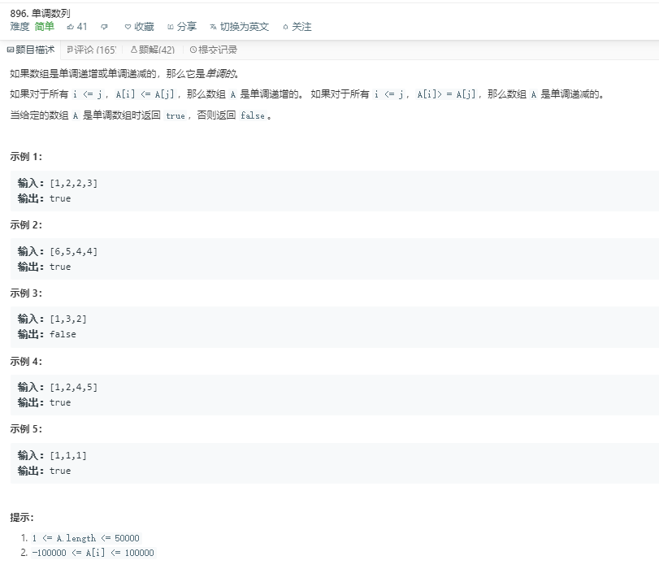

# 896.单调数列
  

```
/**
 * @param {number[]} A
 * @return {boolean}
 */
var isMonotonic = function(A) {
    let one = [],two=[];
    A.forEach((el)=>{
        if(one.length == 0){
            one.push(el);
        }else{
            if(el <= one[one.length-1]){
                one.push(el);
            }
        }
    })

    A.forEach((el)=>{
        if(two.length == 0){
            two.push(el);
        }else{
            if(el >= two[two.length-1]){
                two.push(el);
            }
        }
    })

    console.log(one,two);
    if(one.length == A.length || two.length == A.length){
        return true;
    }else{
        return false;
    }
};
```