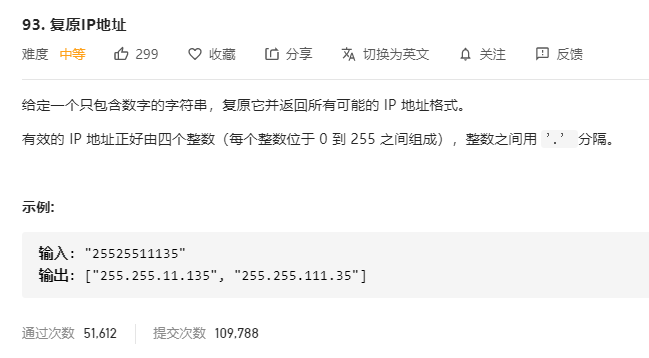

# 93.复原IP地址
  

```
/**
 * @param {string} s
 * @return {string[]}
 */
var restoreIpAddresses = function(s) {
    let res = [];

    let ss = s.split('');

    if(ss.length > 16) {
        return [];
    }

    const mid = (temp, who) => {
        if(temp.length === 4) {
            let can = true, len = 0;
            temp.map((el) => {
                let ee = el.split('');
                if(ee.length > 1) {
                    while(ee[0] == '0') {
                        ee.shift();
                    }
                }
                if((+el) > 255 || ee.length != el.length) {
                    can = false;
                }
                len += el.length;
            })
            if(can && len === s.length && res.indexOf(temp.join('.')) < 0) {
                res.push(temp.join('.'));
            }

            return ;
        }


        for(let i=0;i<ss.length;i++) {
            if(who.length == 0 || who[who.length - 1] < i) {
                who.push(i);
                temp.push(ss[i]);
                mid(temp.slice(), who.slice());
                who.pop();
                temp.pop();
                who.push(i+1);
                temp.push(ss.slice(i,i+2).join(''));
                mid(temp.slice(), who.slice());
                who.pop();
                temp.pop();
                who.push(i+2);
                temp.push(ss.slice(i,i+3).join(''));
                mid(temp.slice(), who.slice());
                who.pop();
                temp.pop();
            }
        }        
    }

    mid([], []);

    console.log(res);

    return res;
};
```