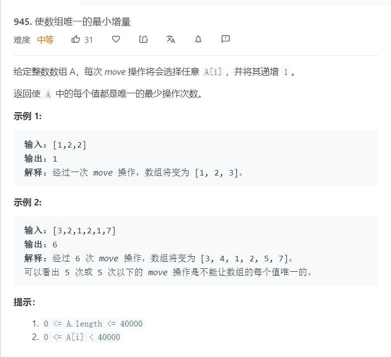

# 945.使数组唯一的最小增量
  


## 排序后递增
```
/**
 * @param {number[]} A
 * @return {number}
 */
var minIncrementForUnique = function(A) {
    let mounte = 0;
    A.sort((a,b)=>a-b)
    for(let i=1;i<A.length;i++){
        while(A[i]<=A[i-1]){
            A[i]++;
            mounte++;
        }
    }

    return mounte;
};
```