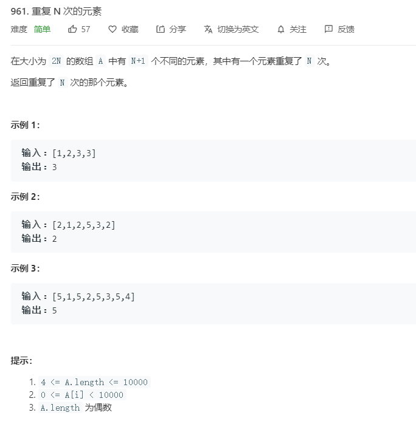

# 961.重复N次的元素
  

```
/**
 * @param {number[]} A
 * @return {number}
 */
var repeatedNTimes = function(A) {
    A.sort((a,b)=>a-b);
    let mid = A.length >> 1;
    console.log(mid,A.length);
    if(A[mid+1] == A[mid]){
        return A[mid];
    }else{
        return A[mid-1];
    }
};
```