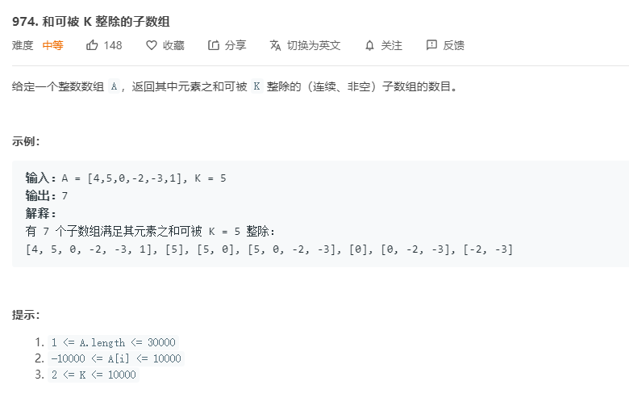

# 974.和可被K整除的子数组
  

```
/**
 * @param {number[]} A
 * @param {number} K
 * @return {number}
 */
var subarraysDivByK = function(A, K) {
    let count = 0;
    let mate = {0:1}, addnum = 0;

    for(let i=0;i<A.length;i++) {
        addnum = (addnum + A[i]) % K;
        if(addnum < 0) {
            addnum += K;
        }

        if(mate[addnum]) {
            count += mate[addnum];
        }

        if(mate[addnum]) {
            mate[addnum]++
        }else {
            mate[addnum] = 1;
        }
    }

    return count;
};
```