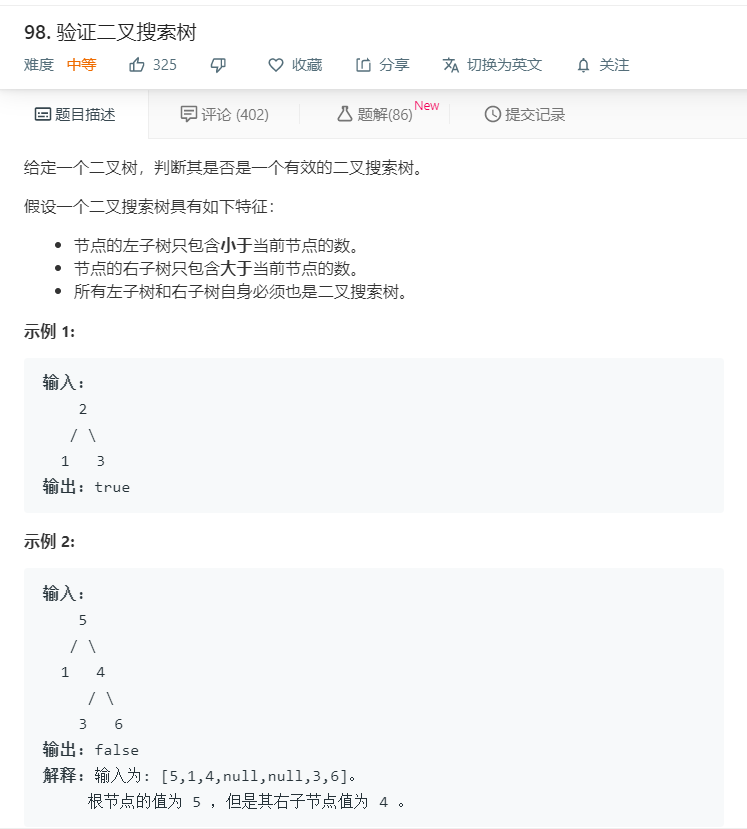

# 98.验证二叉搜索树
  

## 中序遍历
```
/**
 * Definition for a binary tree node.
 * function TreeNode(val) {
 *     this.val = val;
 *     this.left = this.right = null;
 * }
 */
/**
 * @param {TreeNode} root
 * @return {boolean}
 */
var isValidBST = function(root) {
    if(!root){
        return true;
    }
    let temp = [];
    function inorder(mid){
        if(!(mid == null)){
            inorder(mid.left);
            temp.push(mid.val);
            inorder(mid.right);
        }
    }

    inorder(root);
    let result = temp.slice(0);
    temp.sort((a,b)=>a-b);

    for(let i=0;i<temp.length-1;i++){
        for(let j=i+1;j<temp.length;j++){
            if(temp[i] == temp[j]){
                return false;
            }
        }
    }
    console.log(temp,result);
    for(let i=0;i<temp.length;i++){
        if(result[i]!=temp[i]){
            return false;
        }
    }
    return true;
};
```

## 递归
```
/**
 * Definition for a binary tree node.
 * function TreeNode(val) {
 *     this.val = val;
 *     this.left = this.right = null;
 * }
 */
/**
 * @param {TreeNode} root
 * @return {boolean}
 */
var isValidBST = function(root) {
    return one(root,-Infinity,Infinity);
};

let one = (r,lower,upper) => {
    if(!r) {
        return true;
    }
    if(r.val <= lower || r.val >= upper) {
        return false;
    }

    return one(r.left,lower,r.val) && one(r.right,r.val,upper);
}
```