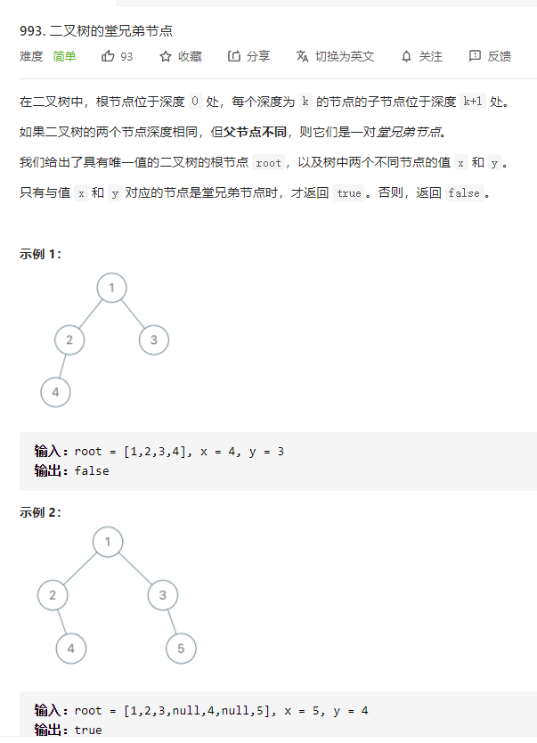

# 993.二叉树的堂兄弟节点
  

```
/**
 * Definition for a binary tree node.
 * function TreeNode(val, left, right) {
 *     this.val = (val===undefined ? 0 : val)
 *     this.left = (left===undefined ? null : left)
 *     this.right = (right===undefined ? null : right)
 * }
 */
/**
 * @param {TreeNode} root
 * @param {number} x
 * @param {number} y
 * @return {boolean}
 */
var isCousins = function(root, x, y) {
    let res = [], can = true;

    const mid = (r, hei) => {
        if (r) {
            if (!res[hei]) {
                res[hei] = [];
            }

            res[hei].push(r.val);

            if (r.left && r.right && ((r.left.val === x && r.right.val === y) || (r.right.val === x && r.left.val === y))) {
                can = false;
            }
            mid(r.left, hei + 1);
            mid(r.right, hei + 1);
        }
    }

    mid(root, 0);

    let one = 0, two = 0;

    res.map((el, index) => {
        if (el.indexOf(x) > -1) {
            one = index;
        }

        if (el.indexOf(y) > -1) {
            two = index;
        }
    })

    console.log(one, two, can)

    return one === two && can;
};
```