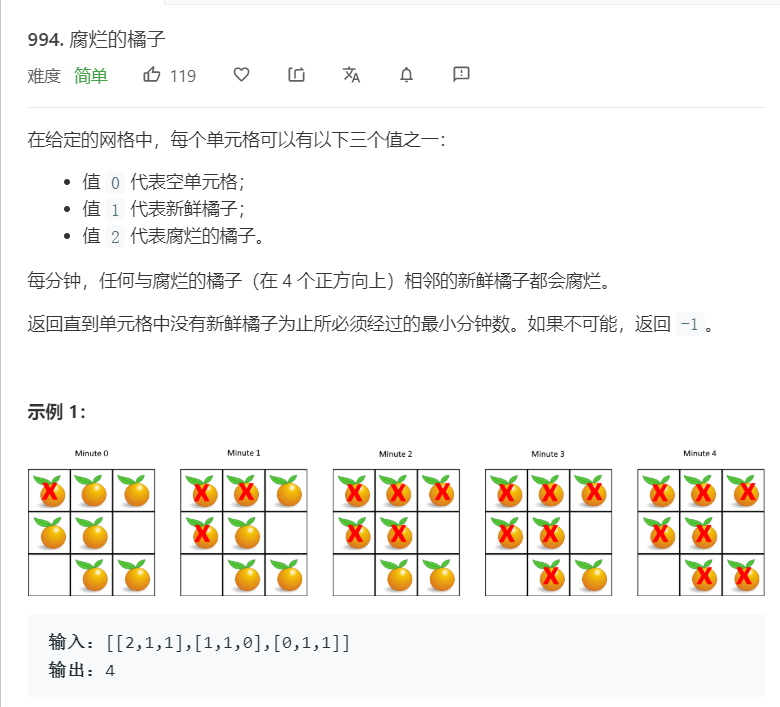

# 994.腐烂的橘子
  

```
/**
 * @param {number[][]} grid
 * @return {number}
 */
var orangesRotting = function(grid) {
    let m = grid.length,n = grid[0].length;
    if(m == 0){
        return -1;
    }

    let cannotuse = [],needchange = 0;
    grid.forEach((el,index)=>{
        el.forEach((els,indexs)=>{
            if(els == 2){
                cannotuse.push([index,indexs]);
                el[indexs] = 3;
            }
            if(els == 1){
                needchange += 1;
            }
        })
    })

    if(needchange == 0){
        return 0;
    }
    console.log(cannotuse);
    let resultnum = 0;
    while(cannotuse.length > 0){
        let temp = [];
        for(let i = 0;i<cannotuse.length;i++){
            let el = cannotuse[i];
            if(el[0]-1 >= 0 && grid[el[0]-1][el[1]] == 1){
                grid[el[0]-1][el[1]] = 3;
                temp.push([el[0]-1,el[1]]);
                needchange -= 1;
            }
            if(el[0]+1 < m && grid[el[0]+1][el[1]] == 1){
                grid[el[0]+1][el[1]] = 3;
                temp.push([el[0]+1,el[1]]);
                needchange -= 1;
            }
            if(el[1]-1 >= 0 && grid[el[0]][el[1]-1] == 1){
                grid[el[0]][el[1]-1] = 3;
                temp.push([el[0],el[1]-1]);
                needchange -= 1;
            }
            if(el[1]+1 < n && grid[el[0]][el[1]+1] == 1){
                grid[el[0]][el[1]+1] = 3;
                temp.push([el[0],el[1]+1]);
                needchange -= 1;
            }
            console.log(temp);
        }
        // console.log(temp)
        if(temp.length > 0){
            cannotuse = temp;
            resultnum += 1;
        }else{
            console.log(temp)
            break;
        }
    }
    console.log(grid)
    console.log(resultnum);
    if(needchange == 0){
        return resultnum;
    }else{
        return -1;
    }
};
```