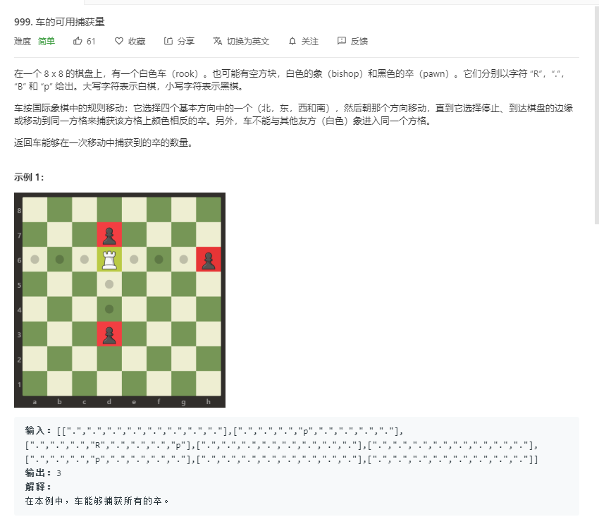
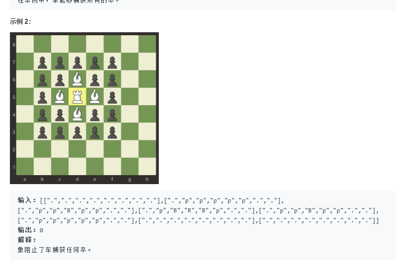
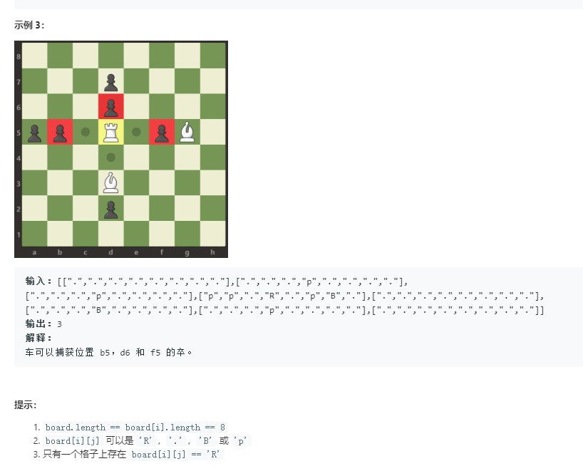

# 999.车的可用捕获量
  

   

    

```
/**
 * @param {character[][]} board
 * @return {number}
 */
var numRookCaptures = function(board) {
    let myr = 0,tempi = 0,tempj = 0;
    for(let i=0;i<board.length;i++){
        for(let j=0;j<board[i].length;j++){
            if(board[i][j] == 'R'){
                tempi = i;
                tempj = j;
            }
        }
    }

    console.log(tempi,tempj)
    let i = tempi,j = tempj;
    for(let jj = j-1;jj>=0;jj--){

        if(board[i][jj] == 'B'){
            console.log(i,jj)
            break;
        }
        if(board[i][jj] == 'p'){
            console.log(i,jj)
            myr++;
            break;
        }
    }
    for(let jj = j+1;jj < board[i].length;jj++){
        if(board[i][jj] == 'B'){
            console.log(i,jj)
            break;
        }
        if(board[i][jj] == 'p'){
            console.log(i,jj)
            myr++;
            break;
        }
    }
    for(let jj = i+1;jj < board.length;jj++){
        if(board[jj][j] == 'B'){
            console.log(j,jj)
            break;
        }
        if(board[jj][j] == 'p'){
            console.log(j,jj)
            myr++;
            break;
        }
    }
    for(let jj = i-1;jj >= 0;jj--){
        if(board[jj][j] == 'B'){
            console.log(j,jj)
            break;
        }
        if(board[jj][j] == 'p'){
            console.log(j,jj)
            myr++;
            break;
        }
    }

    return myr;
};
```