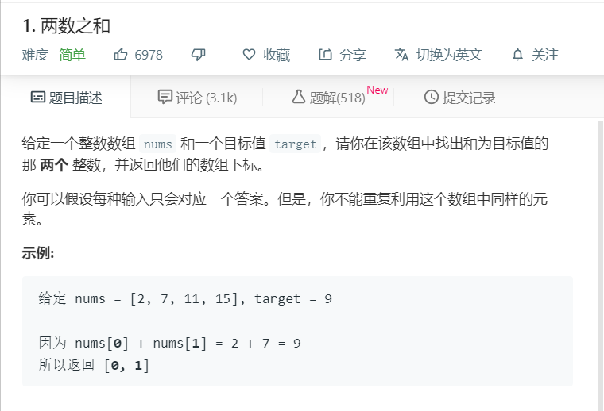

# 1.两数之和
  

```
/**
 * @param {number[]} nums
 * @param {number} target
 * @return {number[]}
 */
var twoSum = function(nums, target) {
    for(let i=0;i<nums.length-1;i++){
        for(let j=i+1;j<nums.length;j++){
            if(nums[i]+nums[j]==target){
                return [i,j];
            }
        }
    }
};
```