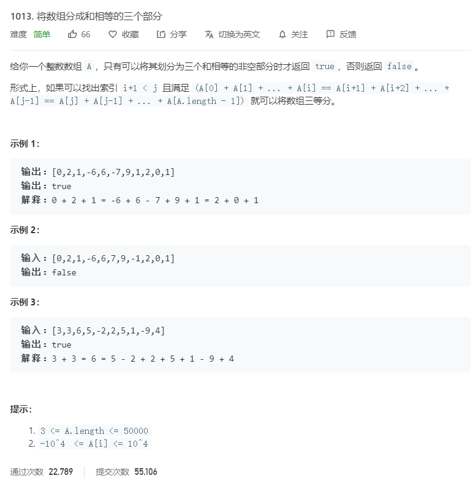

# 1013.将数组分成和相等的三个部分
  

```
/**
 * @param {number[]} A
 * @return {boolean}
 */
var canThreePartsEqualSum = function(A) {
    let left = 0,right=0,one = 0,two = 0;
    for(let i=0;i<A.length;i++){
        left += A[i];
        right = 0;
        for(let j=A.length-1;j>i;j--){
            right += A[j];
            if(left == right){
                one = i;
                two = j;
                console.log(left,right,i,j)
                break;
            }
        }
        if(left == right && one+1 != two){
            let mid = 0;
            for(let i=one+1;i<two;i++){
                mid += A[i];
            }

            if(mid == left){
                return true;
            }
        }
    }

    return false;
};
```