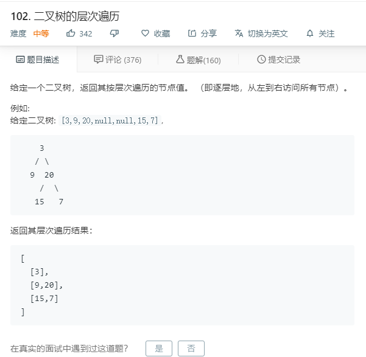

# 102.二叉树的层次遍历
  

```
/**
 * Definition for a binary tree node.
 * function TreeNode(val) {
 *     this.val = val;
 *     this.left = this.right = null;
 * }
 */
/**
 * @param {TreeNode} root
 * @return {number[][]}
 */
var levelOrder = function(root) {
    let temp = [];
    if(!root){
        return [];
    }

   function mid(r,hei){
       if(!r){
           return;
       }

       if(!temp[hei]){
           temp[hei] = [];
       }

       temp[hei].push(r.val);

       if(r.left){
           mid(r.left,hei+1);
       }

       if(r.right){
           mid(r.right,hei+1);
       }
   }

   mid(root,0);

   return temp;
};
```

### 非递归

```
/**
 * Definition for a binary tree node.
 * function TreeNode(val) {
 *     this.val = val;
 *     this.left = this.right = null;
 * }
 */
/**
 * @param {TreeNode} root
 * @return {number[][]}
 */
var levelOrder = function(root) {
   if (!root) return []
  let res = [], queue = [root]
  while (queue.length) {
    let arr = [], temp = []
    while (queue.length) {
      let curr = queue.shift()
      arr.push(curr.val)
      if (curr.left) temp.push(curr.left)
      if (curr.right) temp.push(curr.right)
    }
    queue = temp
    res.push(arr)
  }
  return res

};
```