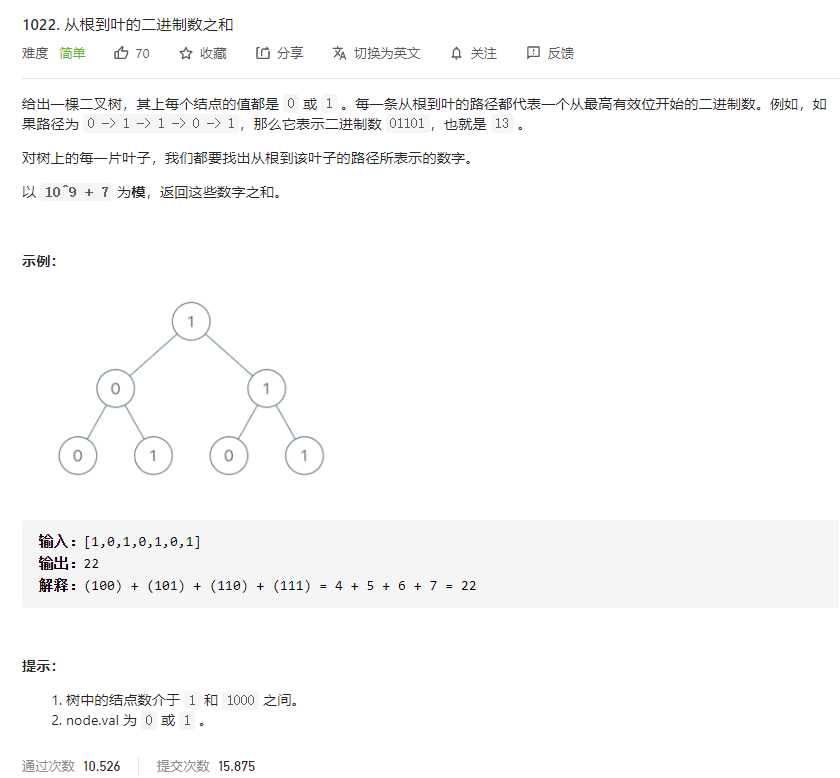

# 1022.从根到叶的二进制数之和
  

```
/**
 * Definition for a binary tree node.
 * function TreeNode(val, left, right) {
 *     this.val = (val===undefined ? 0 : val)
 *     this.left = (left===undefined ? null : left)
 *     this.right = (right===undefined ? null : right)
 * }
 */
/**
 * @param {TreeNode} root
 * @return {number}
 */
var sumRootToLeaf = function(root) {
    let res = [root], num = [root.val], only = 0;
    

    while(res.length > 0) {
        let len = res.length;
        while(len--) {
            let now = res.shift();
            let nowNum = num.shift();

            if (now.left) {
                res.push(now.left);
                num.push(nowNum + '' + now.left.val);
            }

            if (now.right) {
                res.push(now.right);
                num.push(nowNum + '' + now.right.val);
            } 

            if (!now.left && !now.right) {
                only += parseInt(nowNum, 2);
            }
        }
    }

    return only; 
};
```