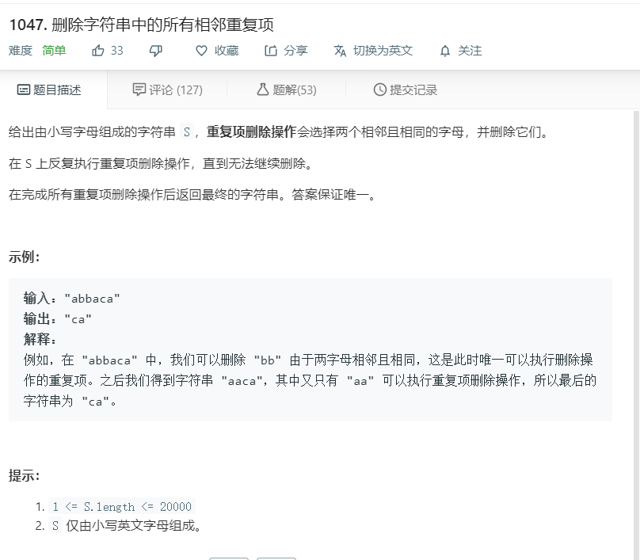

# 1047.删除字符串中的所有相邻重复项
  

```
/**
 * @param {string} S
 * @return {string}
 */
var removeDuplicates = function(S) {
    let temp = [];
    for(let i of S){
        if(i == temp[temp.length-1]){
            temp.pop();
        }else{
            temp.push(i);
        }
    }
    return temp.join('');
};
```