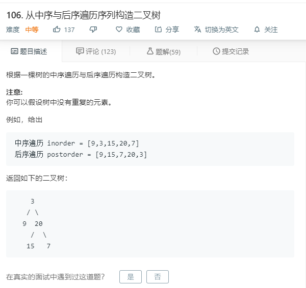

# 106.从中序与后序遍历序列构造二叉树
  

```
/**
 * Definition for a binary tree node.
 * function TreeNode(val) {
 *     this.val = val;
 *     this.left = this.right = null;
 * }
 */
/**
 * @param {number[]} inorder
 * @param {number[]} postorder
 * @return {TreeNode}
 */
var buildTree = function(inorder, postorder) {
    if(postorder.length == 0){
        return null;
    }
    
    let mid = postorder[postorder.length-1];
    let father = new TreeNode(mid);
    let position = inorder.indexOf(mid);
    let left = inorder.slice(0,position);
    let right = inorder.slice(position+1);
    father.left = buildTree(left,postorder.slice(0,left.length));
    father.right = buildTree(right,postorder.slice(left.length,postorder.length-1));
    return father;
};
```