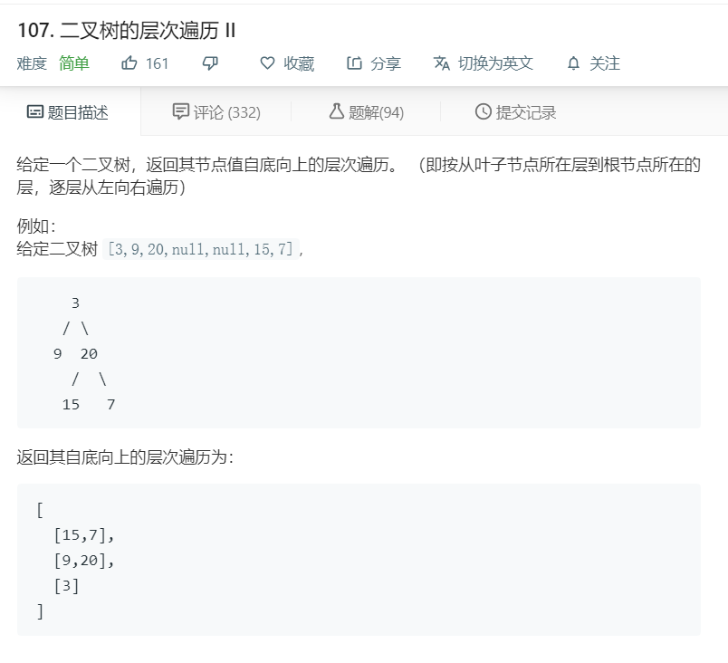

# 107.二叉树的层次遍历II
  

```
/**
 * Definition for a binary tree node.
 * function TreeNode(val) {
 *     this.val = val;
 *     this.left = this.right = null;
 * }
 */
/**
 * @param {TreeNode} root
 * @return {number[][]}
 */
var levelOrderBottom = function(root) {
    let temp = [];
    function mid(r,hei){
        if(!r)return;
        if(temp[hei]){
           temp[hei].push(r.val); 
        }else{
            temp[hei] = [r.val];
        }

        if(r.left){
            mid(r.left,hei+1);
        }

        if(r.right){
            mid(r.right,hei+1);
        }
    }

    mid(root,0);
    return temp.reverse();
};


```