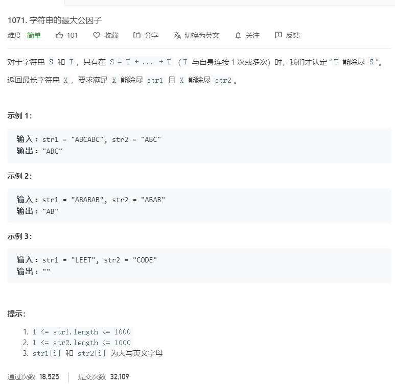

# 1071.字符串的最大公因子
  

```
/**
 * @param {string} str1
 * @param {string} str2
 * @return {string}
 */
var gcdOfStrings = function(str1, str2) {
    let min = str1.length > str2.length ? str2 : str1;
    min = min.split('');
    let temp = '',result = [];
    for(let i=0;i<min.length;i++){
        temp += min[i];
        let one = str1.split(temp).join('').length;
        let two = str2.split(temp).join('').length;
        if(one == 0 && 0 == two){
            result.push(temp);
        }
    }
    if(result.length == 0){
        return "";
    }else{
        return result.pop();
    }
};
```