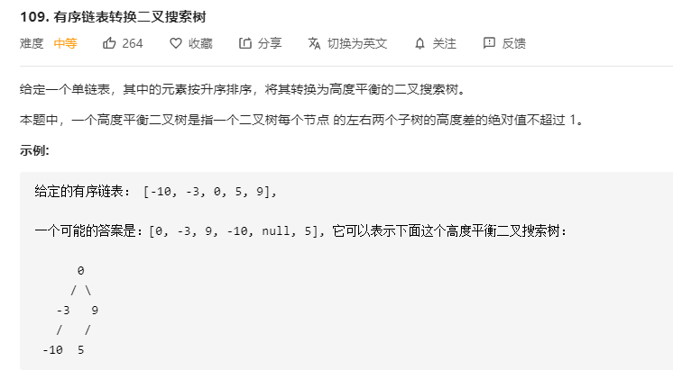

# 109.有序链表转换二叉搜索树
  

```
/**
 * Definition for singly-linked list.
 * function ListNode(val) {
 *     this.val = val;
 *     this.next = null;
 * }
 */
/**
 * Definition for a binary tree node.
 * function TreeNode(val) {
 *     this.val = val;
 *     this.left = this.right = null;
 * }
 */
/**
 * @param {ListNode} head
 * @return {TreeNode}
 */
var sortedListToBST = function(head) {
    

    let temp = [];

    while(head) {
        temp.push(head.val);
        head = head.next;
    }

    const forRoot = (head) => {
        if(!head || head.length === 0) {
            return null;
        }

        const mid =  Math.floor(head.length / 2);
        const r = new TreeNode(head[mid]);

        r.left = forRoot(head.slice(0, mid));
        r.right = forRoot(head.slice(mid + 1));

        return r;
    }

    let res = forRoot(temp);

    return res;
};
```

```
/**
 * Definition for singly-linked list.
 * function ListNode(val) {
 *     this.val = val;
 *     this.next = null;
 * }
 */
/**
 * Definition for a binary tree node.
 * function TreeNode(val) {
 *     this.val = val;
 *     this.left = this.right = null;
 * }
 */
/**
 * @param {ListNode} head
 * @return {TreeNode}
 */
var sortedListToBST = function(head) {
    const forRoot = (head, end) => {
        if(head === end) {
            return null;
        }
        let slow = head, fast = head;
        while(fast != end && fast.next != end) {
            slow = slow.next;
            fast = fast.next.next;
        }

        let r = new TreeNode(slow.val);
        r.left = forRoot(head, slow);
        r.right = forRoot(slow.next, end);

        return r;
    }

    return forRoot(head, null);
};
```