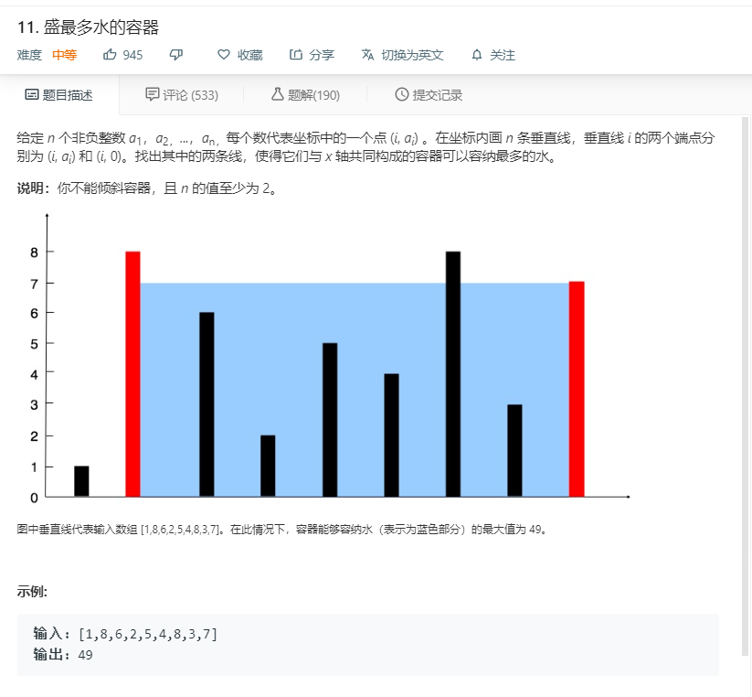

# 11.盛最多水的容器
  

```
/**
 * @param {number[]} height
 * @return {number}
 */
var maxArea = function(height) {
    let one = 0,two = height.length-1,max=0,temp=0;
    while(one < two){
        if(height[one] < height[two]){
            temp = (two-one)*height[one];
            one++;
        }else{
            temp = (two-one)*height[two];
            two--;
        }
        max = Math.max(max,temp);
    }
    return max;
};
```