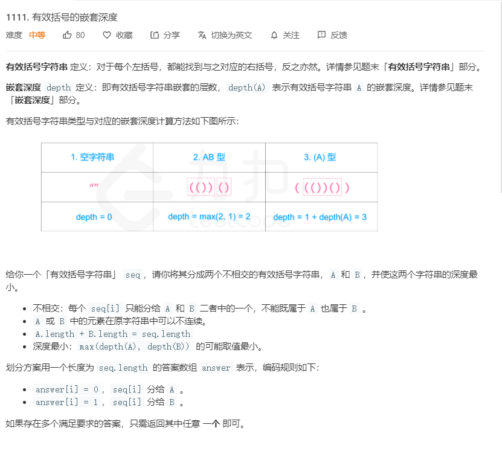
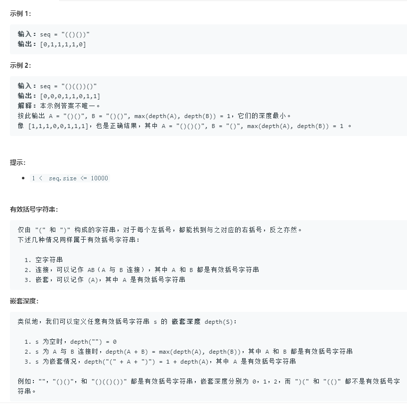
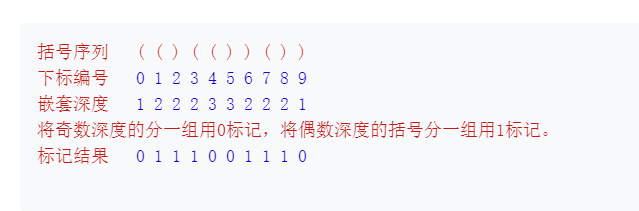

# 1111.有效括号的嵌套深度
  

  

  

```
/**
 * @param {string} seq
 * @return {number[]}
 */
var maxDepthAfterSplit = function(seq) {
    let temp = [],result = [];
    seq = seq.split('');
    while(seq.length > 0){
        if(temp.length == 0 || seq[0] == '('){
            temp.push(seq.shift());
            result.push(temp.length);
        }else{
            temp.pop();
            seq.shift();
            result.push(temp.length+1);
        }
    }

    let one = [];
    result.map((el)=>{
        if(el % 2 == 0){
            one.push(1);
        }else{
            one.push(0);
        }
    })

    return one;
};
```