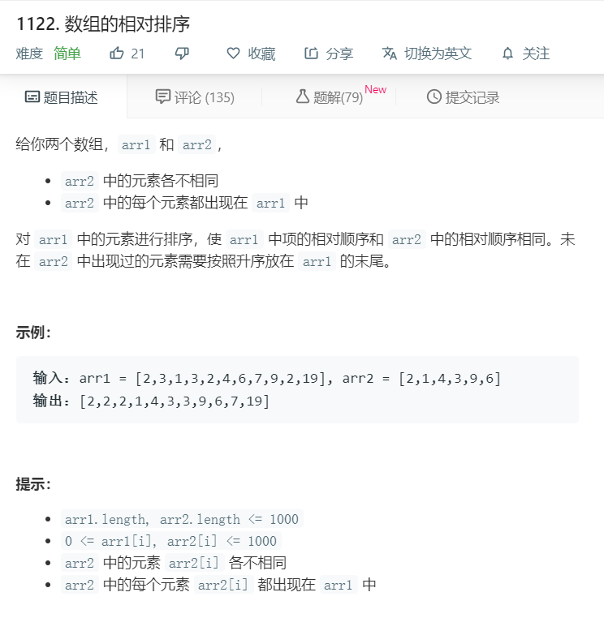

# 1122.数组的相对排序
  

```
/**
 * @param {number[]} arr1
 * @param {number[]} arr2
 * @return {number[]}
 */
var relativeSortArray = function(arr1, arr2) {
    let temp = [];
    for(let i=0;i<arr2.length;i++){
        for(let j=0;j<arr1.length;j++){
            if(arr1[j] == arr2[i]){
                temp.push(arr1[j]);
            }
        }
    }

    arr1.sort((a,b)=>a-b);

    for(let i=0;i<arr1.length;i++){
        if(arr2.indexOf(arr1[i])<0){
            temp.push(arr1[i]);
        }
    }

    return temp;
};
```