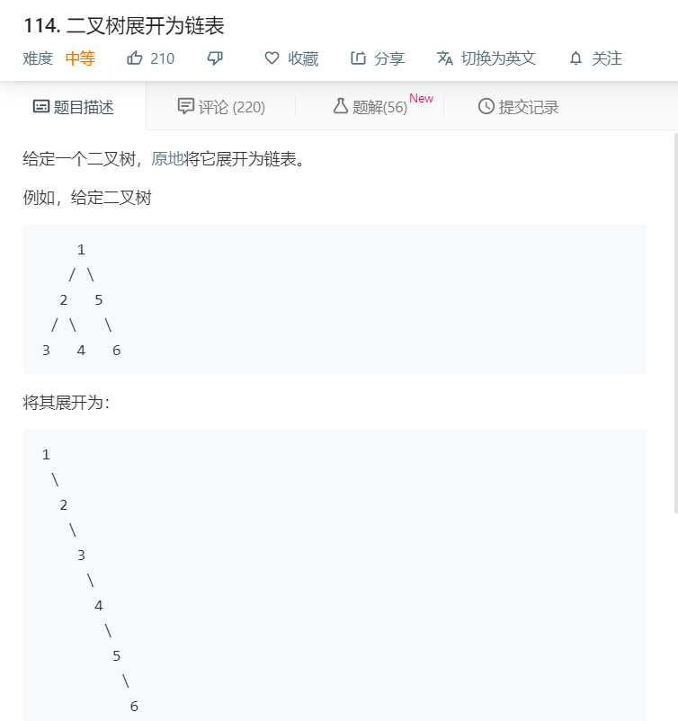

# 114.二叉树展开为链表
  

```
/**
 * Definition for a binary tree node.
 * function TreeNode(val) {
 *     this.val = val;
 *     this.left = this.right = null;
 * }
 */
/**
 * @param {TreeNode} root
 * @return {void} Do not return anything, modify root in-place instead.
 */
var flatten = function(root) {
    if(!root){
        return root;
    }
    let temp = [];
    function mid(r){
        if(r != null){
            temp.push(r);
            mid(r.left);
            mid(r.right);
        }
    }
    mid(root);
    for(let i=0;i<temp.length-1;i++){
        temp[i].right = temp[i+1];
        temp[i].left = null;
    }
    temp[temp.length-1].right = null;
    return temp[0];
};
```