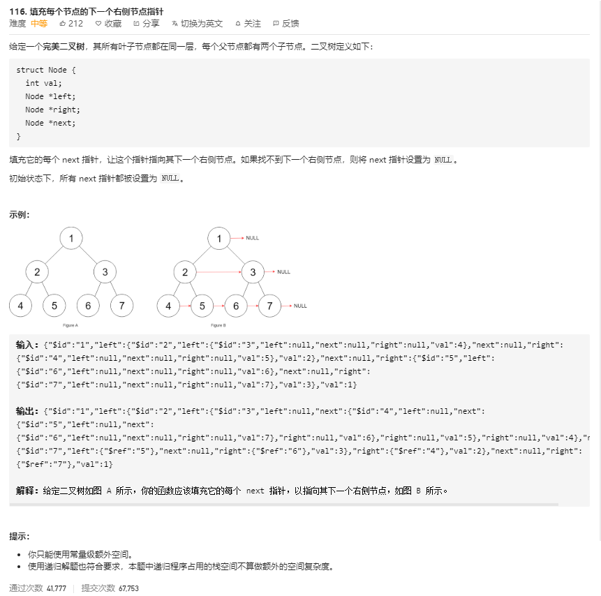
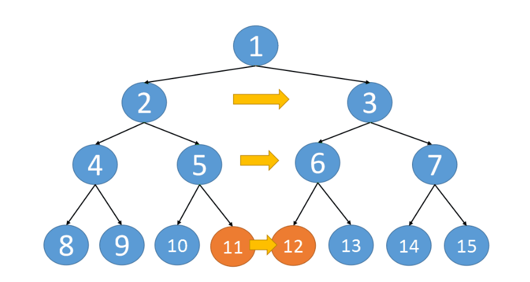

# 116.填充每个节点的下一个右侧节点指针
  

```
/**
 * // Definition for a Node.
 * function Node(val, left, right, next) {
 *    this.val = val === undefined ? null : val;
 *    this.left = left === undefined ? null : left;
 *    this.right = right === undefined ? null : right;
 *    this.next = next === undefined ? null : next;
 * };
 */

/**
 * @param {Node} root
 * @return {Node}
 */
var connect = function(root) {
    if(!root) {
        return null;
    }
    const temp = [];

    const mid = (r, height) => {
        if(!r) {
            return null;
        }
        if(!temp[height]) {
            temp[height] = [];
        } 

        temp[height].push(r);
        mid(r.left, height + 1);
        mid(r.right, height + 1);
    }

    mid(root, 0);

    // console.log(temp);

    temp.map((el) => {
        for(let i=0;i<el.length;i++) {
            if(i === el.length - 1) {
                el[i].next = null;
            } else {
                // console.log(el[i], el[i+1]);
                el[i].next = el[i+1];
            }
        }
    })

    // console.log(temp);

    return temp[0][0];
};
```



```
class Solution {
	public Node connect(Node root) {
		dfs(root);
		return root;
	}
	
	void dfs(Node root) {
		if(root==null) {
			return;
		}
		Node left = root.left;
		Node right = root.right;
		//配合动画演示理解这段，以root为起点，将整个纵深这段串联起来
		while(left!=null) {
			left.next = right;
			left = left.right;
			right = right.left;
		}
		//递归的调用左右节点，完成同样的纵深串联
		dfs(root.left);
		dfs(root.right);
	}
}

```