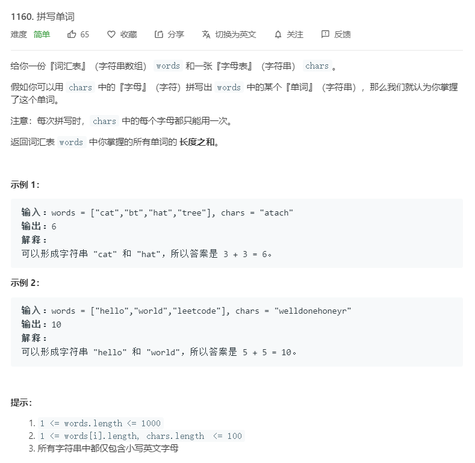

# 1160.拼写单词
  

```
/**
 * @param {string[]} words
 * @param {string} chars
 * @return {number}
 */
var countCharacters = function(words, chars) {
    let result = 0;
    for(let i=0;i<words.length;i++){
        let now = words[i].split(''),temp = chars.split(''),only = 0;
        for(let j=0;j<now.length;j++){
            let position = temp.indexOf(now[j]);
            if(position>=0){
                temp.splice(position,1);
                only+=1;
            }
        }
        console.log(only);
        if(only == now.length){
            result += only;
        }
    }

    return result;
};
```