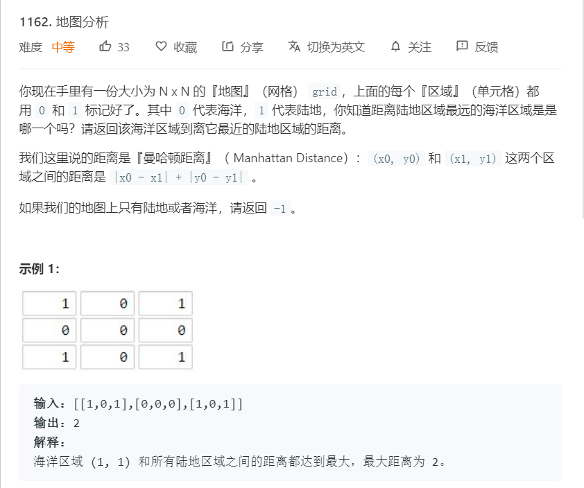
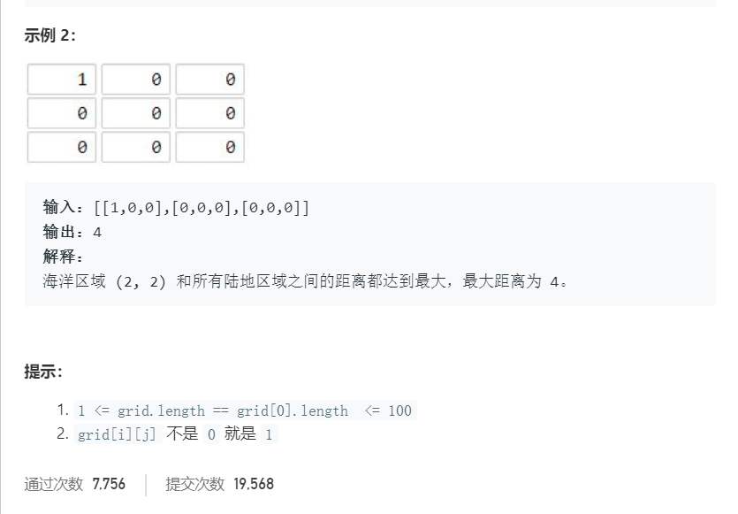
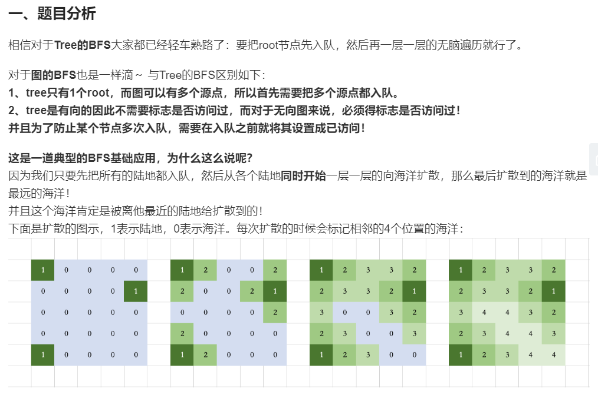

# 1162.地图分析
  

  

  

```
/**
 * @param {number[][]} grid
 * @return {number}
 */
var maxDistance = function(grid) {
    let queue = [];
    let directions = [[1,0],[-1,0],[0,1],[0,-1]];
    for(let i=0;i<grid.length;i++){
        for(let j=0;j<grid[i].length;j++){
            if(grid[i][j] == 1){
                queue.push([i,j]);
            }
        }
    }

    if(queue.length == 0 || queue.length == grid.length * grid[0].length){
        return -1;
    }

    console.log(queue);
    let result = 0;
    while(queue.length > 0){
        let queuelength = queue.length;
        for(let i=0;i<queuelength;i++){
            let now = queue.shift();
            for(let j=0;j<4;j++){
                let tempx = now[0] + directions[j][0],
                    tempy = now[1] + directions[j][1];
                if(tempx >=0 && tempx < grid.length && tempy >= 0 && tempy < grid[0].length 
                    && grid[tempx][tempy] == 0){
                    grid[tempx][tempy] = 2;
                    queue.push([tempx,tempy]);
                }
            }
        }
        result++;
    }

    return result - 1;
};
```