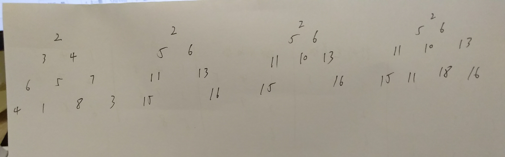

# 120.三角形最小路径和
   



```
/**
 * @param {number[][]} triangle
 * @return {number}
 */
var minimumTotal = function(triangle) {
    let m = triangle.length;
    if(m == 0){
        return 0;
    }

    let temp = new Array(m);
    for(let i=0;i<m;i++){
        temp[i] = new Array(triangle[i].length);
    }

    temp[0][0] = triangle[0][0];
    for(let i=1;i<m;i++){
        temp[i][0] = temp[i-1][0] + triangle[i][0];
        let length = temp[i].length-1;
        temp[i][length] = temp[i-1][temp[i-1].length-1] + triangle[i][length];
    }

    for(let i=2;i<m;i++){
        for(let j=1;j<temp[i].length-1;j++){
            temp[i][j] = Math.min(temp[i-1][j-1],temp[i-1][j]) + triangle[i][j];
        }
    }
    console.log(temp);
    return Math.min(...temp[temp.length-1]);
};
```

## 动态规划
自低向上，从终点往起点逆向考虑  

```
/**
 * @param {number[][]} triangle
 * @return {number}
 */
var minimumTotal = function(triangle) {
    for (let i=triangle.length - 2;i>=0;i--) {
        triangle[i].map((el, index) => {
            let left = triangle[i+1][index],
                right = triangle[i+1][index + 1];

            triangle[i][index] = el + Math.min(left, right);
        })
    }

    console.log(triangle)

    return triangle[0][0];
};
```