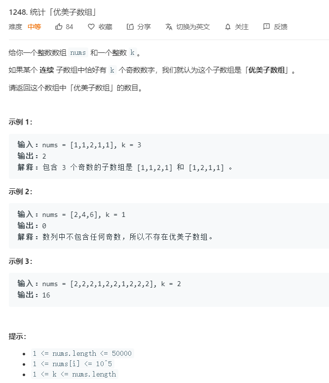

# 1248.统计优美子数组
  

```
/**
 * @param {number[]} nums
 * @param {number} k
 * @return {number}
 */
var numberOfSubarrays = function(nums, k) {
    let temp = [-1],result = 0,start = 1;

    for(let i=0;i<=nums.length;i++){
        if(nums[i] % 2 != 0 || i == nums.length){
            temp.push(i);
        }

        if(temp.length - start > k){
            let left = temp[start] - temp[start-1];
            let right = i - temp[temp.length-2];
            result += left * right;
            start++;
        }
    }

    return result; 
};
```