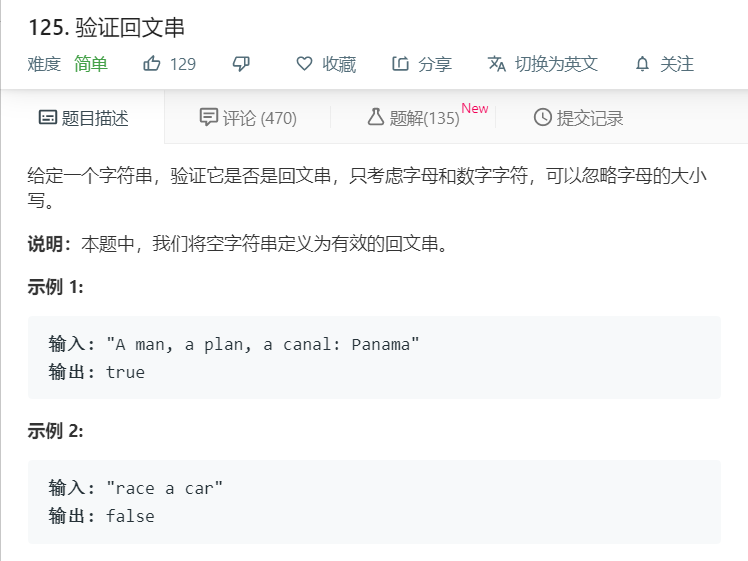

# 125.验证回文串
  

```
/**
 * @param {string} s
 * @return {boolean}
 */
var isPalindrome = function(s) {
    let temp = s.replace(/[^a-zA-Z0-9]/gi,'');
    if(temp.length == 0){
        return true;
    }
    let num = temp.length >> 1;
    console.log(temp,num);
    for(let i=0;i<=num;i++){
      if(temp[i].match(/\d/ig)){
        if(temp[i] != temp[temp.length-i-1]){
          console.log('false');
          return false;
        }
      }else{
        if(temp[i].toLocaleLowerCase() != temp[temp.length-i-1].toLocaleLowerCase()){
          console.log('false');
          return false;
        }
      }
    }
    console.log('true');
    return true;
};

```

```
/**
 * @param {string} s
 * @return {boolean}
 */
var isPalindrome = function(s) {
    s = s.match(/[a-zA-Z0-9]/ig);
    if(!s){
        return true;
    }

    let mid = s.length >> 1;

    for(let i=0;i<mid;i++) {
        if(s[i].toLocaleLowerCase() !== s[s.length-1-i].toLocaleLowerCase()) {
            return false;
        }
    }

    return true;
};
```