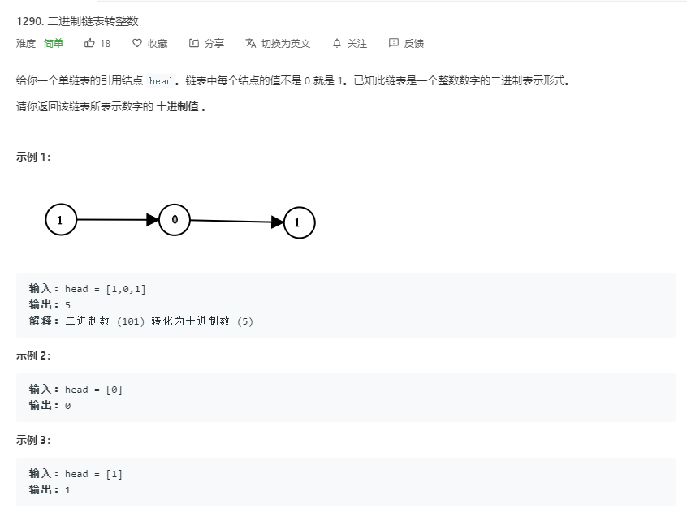

# 1290.二进制链表转整数
  

```
/**
 * Definition for singly-linked list.
 * function ListNode(val) {
 *     this.val = val;
 *     this.next = null;
 * }
 */
/**
 * @param {ListNode} head
 * @return {number}
 */
var getDecimalValue = function(head) {
    let temp = [];
    while(head){
        temp.push(head.val);
        head = head.next;
    }

    let two = temp.join('').toString(2);
    let result = parseInt(two,2);
    console.log(two,result);
    return result;
};
```