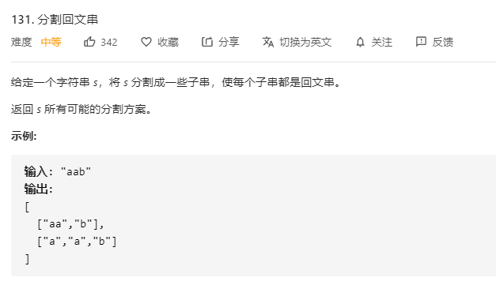

# 131.分割回文串
  

```
/**
 * @param {string} s
 * @return {string[][]}
 */
var partition = function(s) {
    const res = [];
    const len = s.length;
    const can = (now) => {
        let len = now.length;

        const mid = Math.floor(len/2);

        for(let i=0;i<mid;i++) {
            if(now[i] != now[len-1-i]) {
                return false;
            }
        }

        return true;
    }

    const mid = (temp, path, resLen) => {
        // console.log(temp, path, resLen)
        if(resLen >= len) {
            res.push(path);
            return ;
        }

        for(let i=1;i<=temp.length;i++) {
            let now = temp.substring(0, i);
            // console.log("now >>>", now)
            if(can(now)) {
                let last = temp.substring(i);
                path.push(now);
                mid(last, path.slice(0), resLen + now.length);
                path.pop();
            }
        }
    }

    mid(s, [], 0);

    console.log(res);

    return res;
};
```