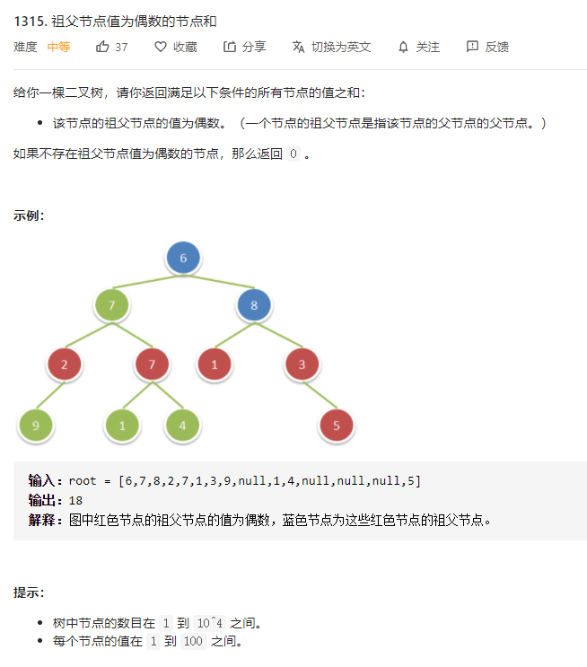

# 1315.祖父节点值为偶数的节点和
  

```
/**
 * Definition for a binary tree node.
 * function TreeNode(val) {
 *     this.val = val;
 *     this.left = this.right = null;
 * }
 */
/**
 * @param {TreeNode} root
 * @return {number}
 */
var sumEvenGrandparent = function(root) {
    let res = 0;

    const mid = (r, father, grad) => {
        if(r) {
            if (grad && grad.val % 2 === 0) {
                res += r.val;
            }

            mid(r.left, r, father);
            mid(r.right, r, father);
        }
    }

    mid(root, null, null);

    return res;
};
```