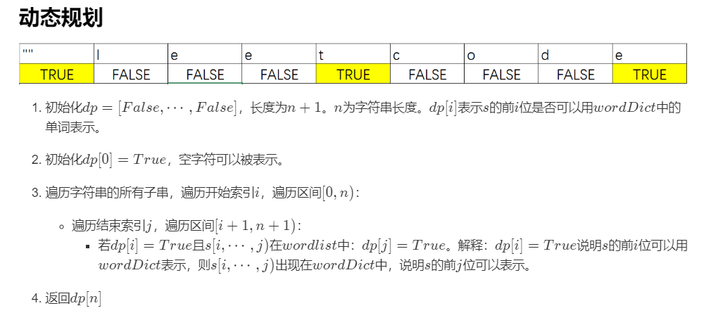

# 139.单词拆分
  

  

```
/**
 * @param {string} s
 * @param {string[]} wordDict
 * @return {boolean}
 */
var wordBreak = function(s, wordDict) {
    let ss = s.split('');
    let temp = new Array(ss.length+1).fill(false);
    temp[0] = true;
    if(ss.length == 1 && wordDict.indexOf(s)>=0){
        return true;
    }
    for(let i=1;i<=ss.length;i++){
        for(let j=0;j<i;j++){
            let now = ss.slice(j,i).join('');
            console.log(now)
            if(temp[j] && wordDict.indexOf(now)>=0){
                temp[i] = true;
            }
        }
    }

    console.log(temp);
    return temp.pop();
};
```