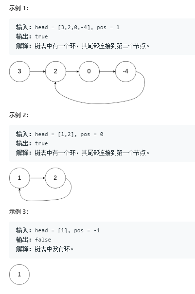

# 141.环形链表  
给定一个链表，判断链表中是否有环。

为了表示给定链表中的环，我们使用整数 pos 来表示链表尾连接到链表中的位置（索引从 0 开始）。 如果 pos 是 -1，则在该链表中没有环。  

  

## 解法一
```
/**
 * Definition for singly-linked list.
 * function ListNode(val) {
 *     this.val = val;
 *     this.next = null;
 * }
 */

/**
 * @param {ListNode} head
 * @return {boolean}
 */
var hasCycle = function(head) {
   let temp = [];
    while(head){
        if(temp.indexOf(head.next)>=0){
            return true;
        }else{
            temp.push(head);
            head = head.next;
        }
    }

    return false;
};
``` 

## 双指针
```
var hasCycle = function(head){
    if(head === null || head.next === null) return false;
    let slow = head,
        fast = head.next;

    while(slow != fast){
        if(fast.next === null || fast.next.next === null) return false;
        slow = slow.next;
        fast = fast.next.next;
    }

    return true;
}
```